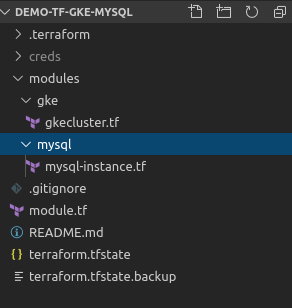

* First of all create a folder named "creds" and past the .json file on it,Give the correct provider creds into the module.tf,{creds are the folder which contain the gcloud project iam service account .json file}

* terraform init
  
  # create a folder called modules and in the modules folder create all the resouces's,instance etc.

  #  all the files inside the modules folder give the extansion .tf

* run command  * terraform plan -out "anyname"
                                {-out is for the  saving the code into local dir as the first code}

* run command  * terraform apply "anyname" {which given on the time of plan}                                

# gke-mysql-terraform

